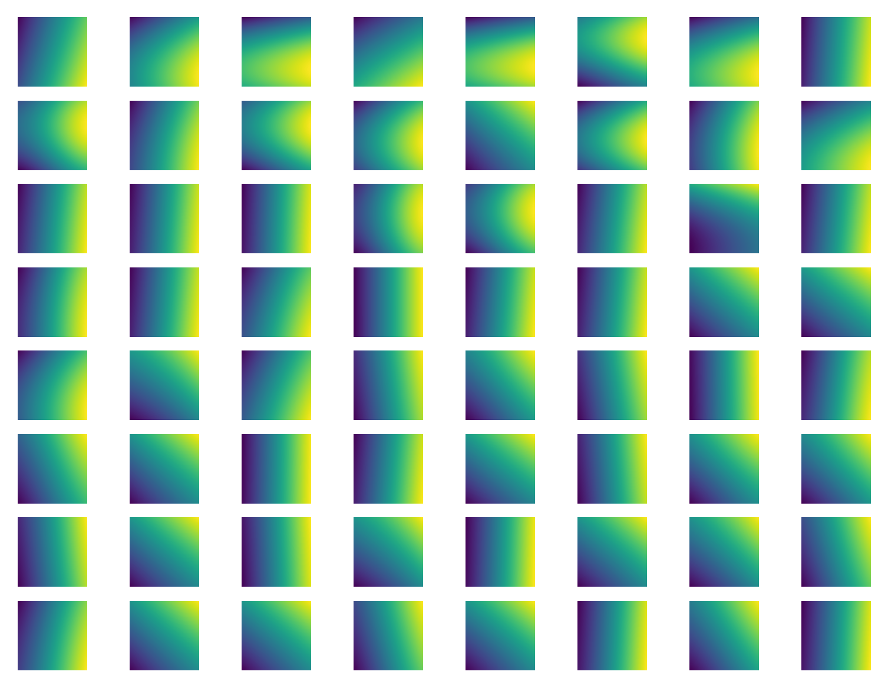

# elita-transformer

**Disclaimer: This project is in early stages, but due to a lack of time and resources, may not continue further. Please take this research into your own hands and cite this page if you do. This was done by an individual on free Colab runtimes, who would very much appreciate your generosity and the recognition.**

<a href="https://www.buymeacoffee.com/acos"></a>

Official Repository for Efficient Linear-Time Attention Transformers. Implementation in Tensorflow2 (PyTorch on the way).
This is a re-working of both the Attention and Feed-Forward elements of a Transformer, resulting in faster and cheaper computation while keeping performance the same, if not in fact better. Yes, it is another linear Attention Transformer, but with its Fourier-like general positional information, its light and much more easily scalable Feed-Forward, as well as extensive ideas in the Other Methods section, I believe more can come of this than its many counterparts.
We compare the results to the SoTA Transformers, with RoPE and SwiGLU etc.


The above results are **preliminary**, on wikitext with models of sizes of <300K params, sequence-length 256 and batch-size 128, using SentencePiece and Adam(min(1e-3, 1e-2/sqrt(step), 0.9, 0.99). (In fact, the diagram shows the poorest performance of ELiTA as it does not have the $Q$ in the logit equation below.) In that test, they were trained over a single epoch, and the test returned from the normal Transformer was lower than the improved one by 0.02, as shown by the dotted lines on the train-loss curves above. However, the model has shown good performance on **sequence-lengths of 100K+** on the Red-Pajama dataset an model sizes of 10M+. I am currently working on training a model of ~80M parameters on the sample of this dataset.

A full paper will hopefully be released at some point. Base code is available on this repo.

# Intuition
The goal is to make Transformers cheaper, so that more powerful LLMs can be developed with less reliance on masses of A100s and TPUv4 pods. Though perhaps it is a long way from that, scaling to much larger sequence lengths and parameters should be easier, and better performance from small models should be more plausible.

## Attention
The attention mechanism manages to be time-linear by using cumulative sums, which though not original, is used in a new way. (This means it is Decoder-only.) Like in original attention, there is a (never used fully) square array of logits which are softmaxed across rows and summed with values, but here, instead of the logit being $Q(x_i)^\top K(x_j)$, it is $K(x_j)+Q(x_i)+P(i, j)$, where the key transformation $K$ is now to a scalar, as is $Q$, as is the positional information $P$. On top of this, if $i=j$, there is an additional, (seperate parameter) key transformation added.

To get a grasp on the generality of this mechanism, picture this. Take a trainable (N, N) matrix, whose entries are $P(i, j)$ (really $c^{\top}(p_{1,j}+p_{2,i})$ ), and sum to it the similarity of the column input with a trainable vector, the similarity of the row input with a different trainable vector, and if it's along the diagonal add, another similarity again. Then, mask and perform standard softmax across rows, and use this as an (N, N) weight.

The original (N, N) matrix, the $P(i, j)$, though not of that size, has a lot of freedom because it's effectively a trainable combination of sine waves, with different phases, amplitudes etc, across both dimensions. Think of the Fourier series to see how this can be any function. Here is an example over 8 heads and 8 layers in a 3M parameter model trained on 750M tokens, what these weights look like. Of course, as they are variant where you are in the sequence relative to the sequence length, at inference, you might want to only take a certain amount of the top right-hand corner of these squares, say a half, to indicate that you want to generate as much as the input.



## Feed-Forward
The Feed-Forward magic works by splitting the dimensions of the down-scale kernel into the model width and linear scale factor, and summing across each of them with seperate inputs. These inputs replace the up-scale, and are simple linear layers with swish on top of sizes width and linear scale factor. More clearly, it is an einsum(i,j,ijk->k), using the two inputs i and j, and the full-size kernel ijk. We use a scale factor of 8 to account for the loss of generality, but this does not have a negative impact as described below.

The reasoning is that LLMs use the up-scale as a memory search and the down-scale as memory storage. Instead of simply approximating the double linear transformation, (with activation in-between), I am making that memory search more efficient; literally, across and along instead of just along.

## True Softmax
The equation for $y_i$ under Attention2 is a true softmax operation. It takes the sum of the first $i$ softmax weights, multiplied by the corresponding $V$ value. The exponentiated logits for row $i$ are $e^{k_2^{\top}x_i},e^{p_{2,i}^{\top}c + k_3^\top x_i}X_0,e^{p_{2,i}^{\top}c + k_3^\top x_i}X_1,\cdots,e^{p_{2,i}^{\top}c + k_3^\top x_i}X_i$. All the values here, including $X$, are $e$ raised to the something. Taking their sum multiplied each time by a corresponding $V$, then dividing by the sum of the unchanged sequence, this is a normal softmax.

## Note on Parameters
If you keep all the model dimensions same (as was done with above wikitext experiment), and layers, heads, etc, there will be a small (~5%) increase in parameter count due to the scale of 8, which is (I find) a good value for this to work, but the parameters saved in attention (as Q and K kernels no longer exist, really) should make up for this.

## Other Methods
I have done considerable other research on this same goal using the ELiTA base. For example, if you think about the Transformer as determining the movement through embedding space forward in a sequence (if you weight-tie then the Transformer is predicting the next token in embedding space), then wrapping the same, but very dynamic model, many times around itself allows you to achieve more with the same number of parameters, as it is simply taking many steps to make the prediction. (Think diffusion, too). Effectively, you are giving it more layers with no extra parameters. Training like this has given good results where you wrap three times, and add a bias depending on which step you are on. Unfortunately, unlike a diffusion model, I am at the moment training all steps together, which is very memory-intensive (not as much, of course, as simply making the model have three times the layers).

To this end I have also tried to train a mapping of embedding space to a metric tensor, and use the Geodesic Equation from relativity to model the movement, and use the initial velocity as a hidden state across each token, but this did not prove too successful, due to the memory constraints of the Christoffel Symbols. However, I am convinced that this research should not be final, as training only the curvature of the space seems a lot less difficult than training the rules of movement from any point to any other.

You can also add the serious bulk of parameters on as a normal Feed-Forward at the end over the logits post weight-tying. In my research I scale from 5000 logits to 8192 back to 5000, with swish activation. This acts as a look-up table on the pre-trained backbone (with the three-fold repetition), with 8192 situations where common errors of the backbone can be fixed, and more factual information can be stored.

# Equations
**Attention2**

Inputs: $x\in\mathbb{R}^{n\times d_1}$

Parameters: $k_i\in\mathbb{R}^{d_1}$, $a_i, b_i, c\in\mathbb{R}^{d_2}$, $V\in\mathbb{R}^{d_3\times d_1}$

Output: $y\in\mathbb{R}^{n\times d_3}$

$$p_{1,i}=\sin(ia_1n^{-1}+b_1)$$

$$p_{2,i}=\sin(ia_2n^{-1}+b_2)$$

$$X_i=e^{k_1^\top x_i+p_{1,i}^\top c}$$

$$y_i=(e^{k_2^\top x_i}Vx_i+e^{p_{2,i}^\top c + k_3^\top x_i}\sum_j^iX_jVx_j)(e^{k_2^\top x_i}+e^{p_{2,i}^\top c + k_3^\top x_i}\sum_j^iX_j)^{-1}$$

**Feed-Forward2**

Inputs: $x\in\mathbb{R}^{d}$

Parameters: $W_1\in\mathbb{R}^{d\times d},W_2\in\mathbb{R}^{d\times 8},W_3\in\mathbb{R}^{d\times d\times 8},b_1\in\mathbb{R}^d,b_2\in\mathbb{R}^8,b_3\in\mathbb{R}^d$

Output: $y\in\mathbb{R}^{d}$

$$\sigma(x)=x(e^{-x}+1)^{-1}$$

$$y=W_3\sigma(W_1x + b_1)\sigma(W_2x + b_2)^\top + b_3$$

# License

[![CC BY-NC-SA 4.0][cc-by-nc-sa-shield]][cc-by-nc-sa]

This work is licensed under a
[Creative Commons Attribution-NonCommercial-ShareAlike 4.0 International License][cc-by-nc-sa].

[cc-by-nc-sa]: http://creativecommons.org/licenses/by-nc-sa/4.0/
[cc-by-nc-sa-shield]: https://img.shields.io/badge/License-CC%20BY--NC--SA%204.0-lightgrey.svg

# Cite
```
{
  name:Efficient Linear-Time Attention Transformers,
  author:ACO Sharma
  date: 08/2023
}
```
