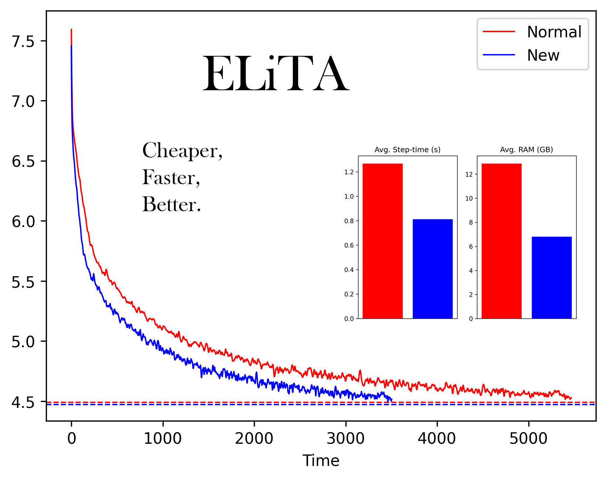

# elita-transformer

**Disclaimer: This project is in early stages, but due to a lack of time and resources, may not continue further. Please take this research into your own hands and cite this page if you do. Remember this was done by an individual on free Colab runtimes.**

Official Repository for Efficient Time-Linear Attention Transformers. Implementation in Tensorflow2.
This is a re-working of both the Attention and Feed-Forward elements of a Transformer, resulting in faster and cheaper computation while keeping performance the same, if not in fact better. Principally, Attention is truly time-linear in sequence length with absolutely no cost to performace, and the heavy $d_{\text{linear}}=4d_{\text{model}}$ being replaced on the up-scale with a much lighter implementation.

The above results are **premilinary**, on WikiText with models of sizes of <300KM params, sequence-length 256 and batch-size 128, using SentencePiece and Adam(min(1e-3, 1e-2/sqrt(step), 0.9, 0.99). In that test, they were trained over a single epoch, and the test returned from the normal Transformer was lower than the improved one by 0.02, as shown by the dotted lines on the train-loss curves above. However, the model has shown good performance on **sequence-lengths of 100K+** on the Red-Pajama dataset an model sizes of 100M+.

A full paper will hopefully be released at some point. Base code is available on this repo.

# Intuition

The goal is to make Transformers cheaper, so that more powerful LLMs can be developped with less reliance on masses of A100s and TPUv4 pods. The attention mechanism effectively uses a global query with a special diagonal query, and a seperate sin-based QKV-eqsue element for positional embeddings, and normal softmax as ever, across. It operates in decoder-mode only as of now. This is all much clearer in the code. The feed-forward magic happens by setting $d_{\text{linear}}=8d_{\text{model}}$ but splitting the dimensions of the input axis in the second (downscale) kernel into two, and summing about each of the two splits (with sizes 8 and model-width) based on two light feed-forwards instead of a heavy upscaler. 

# Equations
**Attention2**

Inputs: $x\in\mathbb{R}^{n\times d_1}$

Parameters: $a_i, b_i, c\in\mathbb{R}^{d_2}$, $V\in\mathbb{R}^{d_3\times d_1}$

Output: $y\in\mathbb{R}^{n\times d_3}$

$$p_{1,i}=\sin(ia_1n^{-1}+b_1)$$

$$p_{2,i}=\sin(ia_2n^{-1}+b_2)$$

$$X_i=e^{k_1^\top x_i+p_{1,i}^\top c}$$

$$y_i=(e^{k_2^\top x_i}Vx_i+e^{p_{2,i}^\top c}\sum_j^iX_jVx_j)(e^{k_2^\top x_i}+e^{p_{2,i}^\top c}\sum_j^iX_j)^{-1}$$

**FeedForward2**

Inputs: $x\in\mathbb{R}^{d}$

Parameters: $W_1\in\mathbb{R}^{d\times d},W_2\in\mathbb{R}^{d\times 8},W_3\in\mathbb{R}^{d\times d\times 8},b_1\in\mathbb{R}^d,b_2\in\mathbb{R}^8,b_3\in\mathbb{R}^d$

Output: $y\in\mathbb{R}^{d}$

$$\sigma(x)=x(e^{-x}+1)^{-1}$$

$$y=W_3\sigma(W_1x + b_1)\sigma(W_2x + b_2)^\top + b_3$$
